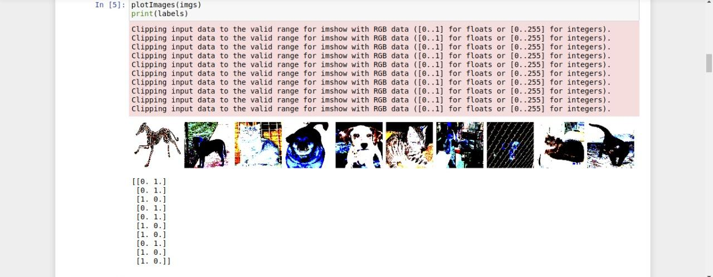

## Dogs-Vs-Cats CNN
**Goal of this model:**
To build and train a CNN that can accurately identify images of cats from those of Dogs.Moreover, fine-tune a **pretrained VGG16 model** and compare how efficient it is in making predictions from our sequential model that we'll build from scratch.

#### Obtaining The Data

For this model we'll use a random subset of the  Kaggle Dogs Versus Cats competition data set. Check it out at Kaggle website.
**Organizing The Data**
This will involve re-organizing the directory structure to hold the data set. Checkout how I finally organized the data in structure in this repo.

### Prerequisite
Before getting your hands on work consider having this pre-installation on your machine:
* Anaconda (*comes with Jupyter Notebook*)
* Python3.6 or higher version 
* Using Anaconda create an environment for Tensorflow CPU/GPU
* Have a modern web browser, preferably Chrome

**NOTE: Remember to activate your Anaconda environment inside the directory you'll be working from. After activating the environment, use conda to install relevant packages that you'll need.**

## Hands-on-work
#### Image Preparation for a CNN model
I'll walk you through the necessary Image preparation steps that I set up before training this CNN model.

First I made the necessary imports. This include: Numpy, Tensorflow(embedded with Keras API), itertools,shutil, random, glob, matplotlib.pyplot and warnings modules.
Next, I created the `train_path`, `valid_path` and`test_path` variables for which the paths to the train, valid, and test data directories were assigned. 

Using the Keras' `ImageDataGenerator` class I created batches of data from the `train`, `valid` and `test` directories. The `ImageDataGenerator.floe_from_directory()` creates a `DirectoryIterator`, which generates batches of normalized tensor image data from the respective data directories.
#### Visualizing The Training Data
I called the `next(train_batches)` to generate a batch of images and labels from the training set. * **Note:** The size of this batch is determined by the `batch_size` we set when we created `train_batches`.

I then used the plotting function obtained from Tensorflow's documentation to plot the processed images within my Jupyter-Notebook.
Below is a snippet of the code;

This what the first processed random batch from the training set looked like. Note that the color appears to be distorted because we applied the VGG16 processing to data sets.It is also important to note that the dogs are represented with the `one-hot encoding` of `[0,1]` and cats represented by `[1,0]`

